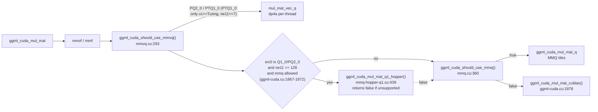

# PrismML weight kernels (PQ2_0 / PTQ1_0)

## What it is

The CUDA kernels that **multiply activations by the model's own weight format**. The target model is stored in PrismML's two private types — **`PQ2_0`** (2-bit, group 128) and **`PTQ1_0`** (ternary, group 128) — and this page covers the code that decodes and dots them: the type declarations, the MMQ tile engines (Ampere/Turing `mma` and Hopper `wgmma`), the MMVQ vec-dot path, and the dispatch that chooses among them.

Two type ids are private high ids in `src/ggml/include/ggml.h`: `GGML_TYPE_PQ2_0 = 142`, `GGML_TYPE_PTQ1_0 = 143` (`:438-439`). The block layouts are in `src/ggml/src/ggml-common.h`:

| Type | Block struct | Group | Body | Codec (from the in-code comment) |
| :--- | :--- | :--- | :--- | :--- |
| `PQ2_0` | `block_pq2_0` (`:205-207`) | `QK_PQ2_0 = 128` (`:202`) | `ggml_half d; uint8_t qs[128/4]` | "Prism-private Q2_0 at group size 128. Same 2-bit codec as Q2_0 (group 64) but one fp16 scale per 128 weights (~5% smaller). Distinct ggml type (142) so it coexists with upstream's group-64 Q2_0 (type 42)" (`:199-201`) |
| `PTQ1_0` | `block_ptq1_0` (`:215-219`) | `QK_PTQ1_0 = 128` (`:214`) | `uint8_t qs[24]` (5 trits/byte → 120 values) + `uint8_t qh[2]` (4 trits/byte → 8 values) + `ggml_half d` | "Same base-3 trit packing as upstream TQ1_0 (type 34) but one fp16 scale per 128 weights instead of per 256. 1.75 bpw vs PQ2_0's 2.125, and lossless for checkpoints that are already ternary at group 128 — TQ1_0 cannot represent those, because a 256-wide scale has to discard one of the two group scales it straddles" (`:209-213`) |

Both `static_assert`s confirm the packed sizes (18 B for `PQ2_0`, 18 B for `PTQ1_0`), which is what makes the formats 2.125 and 1.75 bits per weight respectively.

## How it works

### Three execution paths, chosen by `ggml_cuda_mul_mat`

The dispatch is a chain of predicate tests ending in cuBLAS; the PrismML types enter it in two places (`src/ggml/src/ggml-cuda/ggml-cuda.cu`):

Read literally: a PrismML type that satisfies neither `mmvq` nor `mmq` falls through to cuBLAS, and the wgmma path returns `false` for anything but Hopper, so the caller continues down the chain (the comment at `ggml-cuda.cu:1872` says exactly that).

### The MMQ tile path (the `mma` kernels)

`ggml_cuda_mmq_get_util_funcs<type>` (`mmq.cuh:556`) selects a (load, vec_dot, write_back) triple, and it **branches on `use_mma_data_layout()`** (`mmq.cuh:194-209`):

- **MMA layout branch** (`mmq.cuh:715-761`): `PQ2_0` → `ggml_cuda_mmq_load_tiles_pq2_0` + `ggml_cuda_mmq_vec_dot_q8_0_q8_1_mma<..., MMQ_Q8_1_DS_LAYOUT_D4>` (`:749-754`); `PTQ1_0` → `ggml_cuda_mmq_load_tiles_ptq1_0` with the same mma vec_dot, guarded `#if !defined(GGML_USE_HIP)` (`:755-761`).
- **dp4a branch** (`mmq.cuh:556-585`): the same two types with `..._dp4a` vec_dot/write_back and `VDR_PQ2_0_Q8_1_MMQ` / `VDR_PTQ1_0_Q8_1_MMQ`.
- The gate is `defined(AMD_MFMA_AVAILABLE) || defined(AMD_WMMA_AVAILABLE) || defined(TURING_MMA_AVAILABLE)` at device compile time (`mmq.cuh:203-207`), i.e. **`__CUDA_ARCH__ >= 750`** (`common.cuh:278-280`). The host twin asks `turing_mma_available(cc)` (`mmq.cuh:196`, `common.cuh:348-350`).

The actual instructions live in `mma.cuh`. For int8 operands: `mma.sync.aligned.m16n8k16.row.col.s32.s8.s8.s32` and `...m16n8k32...` on Ampere and newer, **replaced on Turing by 2× or 4× `mma.sync.aligned.m8n8k16`** because "On Turing m16n8k16 mma is not available" (`mma.cuh:920-965`, comments at `:928` and `:950`). Every one of those `asm` blocks is inside `#ifdef TURING_MMA_AVAILABLE`, with `NO_DEVICE_CODE` on the fallthrough (`:915-936`). Block-shape configs come from `mmq-config-{pascal,ampere,blackwell}.cuh`, selected at `mmq.cuh:245-262` (`blackwell_mma_available(cc)` → blackwell; `ggml_cuda_highest_compiled_arch(cc) >= GGML_CUDA_CC_VOLTA` → ampere; else pascal). `PQ2_0` appears in both the pascal and the ampere tables (`mmq-config-pascal.cuh:26-36`, `mmq-config-ampere.cuh:36-45`); **`PTQ1_0` appears only in the ampere table** (16 hits in `mmq-config-ampere.cuh`, 0 in `mmq-config-pascal.cuh`).

### The Hopper WGMMA path

`mmq-hopper-q1.cu` is the opt-in warpgroup path: `using MmaAtom = GMMA::MMA_64x64x32_S32S8S8_SS_TN;` (`:23`), CUTLASS/CuTe `tile_to_shape` shared-memory layouts (`:161-166`), a one-time dense repack of the interleaved blocks (`repack_q1_dense` `:60`, `repack_q2_dense` `:80`), a fp32→int8 activation quantizer with per-128 absmax scale (`quant_act_per128` `:27`), and two kernels — `lowbit_wgmma_ggml<WBITS>` (`:158`, templated on 1 or 2 weight bits) and a stream-K variant `lowbit_wgmma_ggml_sk<WBITS>` (`:282`) chosen when the tile grid is starved (`:490-499`, `ntiles < 8 * nsm`).

The file header is explicit about the build contract: "Active by default when built with `GGML_CUDA_HOPPER_Q1`; set `GGML_HOPPER_Q1_DISABLE` for standard MMQ. **Not bit-identical to standard MMQ**: activations use a per-128-K int8 absmax scale, coarser than q8_1's per-32" (`:1-3`). The CMake option is **OFF** by default and *requires* a CUTLASS checkout (`src/ggml/CMakeLists.txt:203-204`; `src/ggml/src/ggml-cuda/CMakeLists.txt:157-166`, which `FATAL_ERROR`s without `GGML_CUDA_CUTLASS_DIR` and defines `GGML_USE_HOPPER_Q1`).

The entry point `ggml_cuda_mul_mat_q1_hopper` accepts **`Q1_0` and `PQ2_0` only** (`:451`, `is_q1`/`is_q2`), requires `M % 128 == 0 && N % 128 == 0 && K % 128 == 0` and contiguity, and hard-gates the arch: `if (cc < GGML_CUDA_CC_HOPPER || cc >= 1000 ...) return false;` with the comment "sm_90a wgmma only; Blackwell spans CC 1000-1200 and needs the tcgen05 path" (`:452-457`). **`PTQ1_0` never reaches this kernel.**

### The MMVQ vec-dot path (what actually runs on small batches)

`vecdotq.cuh` carries the element kernels: `vec_dot_ptq1_0_q8_1_multi<vdr>` (`:809`, which decodes trits to signed bytes and then accumulates with `ggml_cuda_dp4a` at `:126`, `:146`), `vec_dot_ptq1_0_q8_1` (`:895`), and `vec_dot_pq2_0_q8_1` (`:978`). The vec-dot ratios are set at `vecdotq.cuh:115-118`: `VDR_PQ2_0_Q8_1_MMVQ 1`, `VDR_PTQ1_0_Q8_1_MMVQ 4`, `VDR_PQ2_0_Q8_1_MMQ 2`, `VDR_PTQ1_0_Q8_1_MMQ 2`, each with its rationale in a trailing comment. Dispatch: `mmvq.cu:15-16` (function pointers) and `:46-47` (ratios); `mul_mat_vec_q_switch_ncols_dst` cases at `:1209-1217`.

Two PrismML-specific tunings are visible in `mmvq.cu`:
- `ggml_cuda_should_use_mmvq()` gives `PTQ1_0` its own ceiling: `if (type == GGML_TYPE_PTQ1_0 && cc >= GGML_CUDA_CC_TURING) return ne11 <= 7;` (`:297-300`). On non-Turing NVIDIA — including Volta — that early-out does not fire and the type takes the generic `ne11 <= MMVQ_MAX_BATCH_SIZE` = 8 path (`mmvq.cuh:3`).
- A DGX-Spark (`CC 1210`) branch prefetches `Q1_0`/`Q2_0`/`PQ2_0` blocks into L2 one K-iteration ahead for the `table_id == MMVQ_PARAMETERS_GB10` case (`:669-694`), with `PQ2_0` explicitly excluded from the gate prefetch (`:688`) and from the `should_halve_iters` fast path for the shape `ncols_x == 6144 && nrows_x == 2048` (`:1071`).

### Related PrismML machinery: Hadamard-folded weights

Separate from the quant formats but the same vendor: the loader understands `prism.hadamard.version` / `prism.hadamard.tied_output` metadata (`src/src/llama-model.cpp:1196-1200`), and the context refuses to run a graph in which a Hadamard-folded weight is consumed without its activation-side transform — `throw ... "this graph's matmul path does not support prism.hadamard folding"` (`src/src/llama-context.cpp:37-91`, wired at `:2710-2712`). That is a **weight-space** rotation, not the KV rotation this page describes; it is covered on its own page rather than here.

## Where it lives

| Path | What is there |
| :--- | :--- |
| `src/ggml/include/ggml.h` | type ids `PQ2_0 = 142`, `PTQ1_0 = 143` (`:438-439`) |
| `src/ggml/src/ggml-common.h` | `block_pq2_0` `:199-207`, `block_ptq1_0` `:209-220`, `QI_/QR_` macros `:102-105` |
| `src/ggml/src/ggml-cuda/mmq-hopper-q1.cu` | Hopper wgmma path: header contract `:1-3`, `MmaAtom` `:23`, `quant_act_per128` `:27`, repack kernels `:60`/`:80`, `lowbit_wgmma_ggml` `:158`, `_sk` `:282`, arch/shape gate `:444-457`, entry point `:439-513` |
| `src/ggml/src/ggml-cuda/mmq.cu` | `ggml_cuda_mul_mat_q_switch_type` cases `:17-22`, `ggml_cuda_should_use_mmq()` `:360-444` (`PTQ1_0` → `turing_mma_available` `:375-376`; 48 KiB shared-mem gate `:412-418`; `PTQ1_0` batch knob `:424-435`), launch dispatch `:1000+` |
| `src/ggml/src/ggml-cuda/mmq.cuh` | `MMQ_PTQ1_0_MAX_BATCH_SIZE` `:10`, q8_1 layout `:64-70`, `use_mma_data_layout()` `:194-209`, config selection `:245-262`, d4 layouts `:745-760`, mma vs dp4a util-func switch `:556-585` |
| `src/ggml/src/ggml-cuda/vecdotq.cuh` | VDR defines `:111-118`, PTQ1 decode/`dp4a` `:96-150`, multi-column PTQ1 `:809+`, PQ2 `:978+` |
| `src/ggml/src/ggml-cuda/mmvq.cu` | vec-dot tables `:15-16`, `:46-47`, `PTQ1_0` batch rule `:297-300`, GB10 prefetch `:669-694`, dispatch `:1209-1217` |
| `src/ggml/src/ggml-cuda/mma.cuh` | `mma.sync` int8 asm, Ampere forms + Turing split `:920-965` |
| `src/ggml/src/ggml-cuda/common.cuh` | arch constants `:50-56`, `TURING_MMA_AVAILABLE` `:278-280`, `turing_mma_available` `:348-350` |
| `src/ggml/src/ggml-cuda/ggml-cuda.cu` | `ggml_cuda_mul_mat` chain `:1833-1878`, wgmma call site `:1867-1872` |
| `src/ggml/src/ggml-cuda/CMakeLists.txt`, `src/ggml/CMakeLists.txt` | `GGML_CUDA_HOPPER_Q1` option + CUTLASS requirement `:157-166` / `:203-204` |

## The edit boundary — these kernels are out of scope

The repository's constitution forbids touching them. `AGENTS.md` → *Project Constraints*:

> "This is a Brownfield project. DONT EDIT PrismML CUDA Kernels. Minimal changes in other modules."

So `PQ2_0`/`PTQ1_0` and the Hopper wgmma path are **read-only for this wiki's purposes**: any improvement to how the 27B's weights are multiplied must be routed around this subsystem (upstream, or an exception negotiated with the user), not patched in place. Nothing on this page should be read as proposing an edit. See [[upstream-lineage]] and [[source-agents-md]].

## What Volta has, and what that implies

`sm_70` — the deprecated [[v100-sxm2]] deployment target — has **none** of the tensor-core paths named above:

| Path | Gate | On `sm_70` |
| :--- | :--- | :--- |
| int8 `mma.sync` (the MMQ MMA branch, both for `PQ2_0` and `PTQ1_0`) | `TURING_MMA_AVAILABLE` ⇐ `__CUDA_ARCH__ >= GGML_CUDA_CC_TURING = 750` (`common.cuh:278-280`, `:53`) | **absent** — int8 tensor cores are a Turing feature |
| `PTQ1_0` in MMQ at all | `mmq_supported = turing_mma_available(cc)` (`mmq.cu:375-376`) | **false** → the ternary type cannot take the MMQ tile path |
| Hopper `wgmma` for `PQ2_0` | `cc < GGML_CUDA_CC_HOPPER` → return false (`mmq-hopper-q1.cu:452-453`); also requires the OFF-by-default `GGML_CUDA_HOPPER_Q1` build | **absent** (and `PTQ1_0` is excluded even on H100) |
| FP16 `mma` | `VOLTA_MMA_AVAILABLE` when `__CUDA_ARCH__ == 700` (`common.cuh:273-276`) | **present — but unused here**: every PrismML kernel above is int8 (`s32.s8.s8`) |

The implication for the deployment target is structural, not numeric: **the weight-side matmuls that feed this 27B model execute with no integer tensor-core acceleration on the V100.** `PQ2_0` still passes `ggml_cuda_should_use_mmq()` (it is listed unconditionally in the switch at `mmq.cu:381-383`), but the device code it compiles to takes the **dp4a** branch, because `use_mma_data_layout()` is the `TURING_MMA_AVAILABLE` macro at device compile time (`mmq.cuh:203-207`). `PTQ1_0` is worse off: not only does it lose MMA, it is refused by MMQ altogether on this arch and confined to the MMVQ path (`ne11 <= 8`) or cuBLAS.

This page deliberately states **no throughput penalty**, because none is measured: [[benchmarks]] contains no V100 run, and the only recorded profiling numbers are the RTX 3090 (Ampere, which *has* int8 MMA) and the `magma_sgemmEx` share that belongs to the *KV-cache* path ([[tq-1-missing-gemm-kernels]]), not to these weight kernels. [INFERENCE] What follows from the table above is that the Ampere benchmarks do not transfer: the fastest path measured there is one Volta cannot execute at all.

## Known issues

- [[tq-1-missing-gemm-kernels]] — the sibling gap on the *KV* side (`turbo2/3/4_0` have no MMQ/MMVQ registration and fall into cuBLAS/MAGMA). PrismML's weight types are the counter-example: they *are* registered, and they *do* have kernels — the contrast is what makes the TurboQuant omission look like an oversight rather than a design choice.
- [[gemm-dispatch]] — the dispatch chain this page's flow chart is one edge of.
- [[tq-7-innerq-max-channels]] and the rest of the InnerQ family belong to the KV path, not here, but share the same `AGENTS.md` edit boundary.
- No issue page tracks the Volta/`PTQ1_0` MMQ refusal, because it is inherited upstream behaviour rather than a fork defect. Recorded here so the deployment gap is not rediscovered.

## Open questions

- Is `ggml_cuda_should_use_mmq()`'s 48 KiB shared-memory gate (`mmq.cu:412-418`, `if (smpbo < 48 * 1024) return false;`) satisfied on a V100? `smpbo` is `prop.sharedMemPerBlock` (`ggml-cuda.cu:324`), and the comparison is strict `<`, so a part reporting exactly 48 KiB passes. `[UNVERIFIED]` — no device was queried; this needs a one-line check on the target.
- The pascal config includes `PQ2_0` but not `PTQ1_0`; the ampere config includes both. `ggml_cuda_mmq_get_config` picks ampere for anything with `highest_compiled_arch >= 700` (`mmq.cuh:257-259`), so the pascal table is reachable only for a build compiled exclusively for `sm_61`. Whether that split is deliberate (PTQ1_0 needs the Turing data layout) or incidental is not stated in the code. `[UNVERIFIED]`.
- Whether the 2-bit `PQ2_0` codec is *bit-identical* between the MMQ tile loader and the MMVQ vec-dot (two independent decoders for one format) is not checked here.

## See also

[[ternary-bonsai-2-27b]] · [[gemm-dispatch]] · [[quantization]] · [[tq-1-missing-gemm-kernels]] · [[v100-sxm2]] · [[upstream-lineage]] · [[source-agents-md]] · [[source-readme]] · [[walsh-hadamard-transform]]
