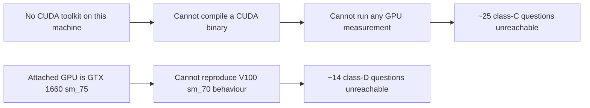

# Open questions

## Bottom line

**84 open questions** are scattered across 22 pages of this vault. They are not one kind of thing, and treating them as one list is why so many of them have survived: most are cheap to answer by reading, a few are impossible without hardware that this machine does not have, and a handful are not questions at all but **decisions waiting to be made**.

The single most useful fact in this page is the blocking chain: *the machine cannot build a CUDA binary and does not have the target GPU*, so anything in class **C** or **D** below is unreachable until the environment changes. Class **A** is where the remaining value is, and it has been shrinking steadily — the two most consequential questions in the vault were both answered this session by **reading, not running**.

> **Answered this session, from reading alone:** the NaN scoring path (now [[ta-8-offset-max-zero-nan]], CONFIRMED), the RoPE scope mismatch (now [[ta-9-rope-scope-mismatch]], CONFIRMED), `freq_scale_sq` as dead code ([[ta-5-freq-scale-dead-code]], refined), whether the tree can be built here (`no` — see below), the 138-vs-142 file discrepancy (resolved exactly), and whether any quantized-kernel unit knows a turbo type (`none does`). Six questions closed, four of them by evidence nobody had collected before.

## What each class costs

| Class | What it takes | Count (approx.) | Reachable today? |
| :--- | :--- | ---: | :--- |
| **A — reading** | Nothing but time in this repo | ~35 | **yes** |
| **B — a decision** | The user's call, not an investigation | ~10 | yes |
| **C — a build or a run** | Compiling and executing, GPU not necessarily V100-specific | ~25 | **no** — see toolchain |
| **D — the target hardware or a missing artifact** | A V100 to profile on, or a checkout/archive that is not on this machine | ~14 | **no** |

### The blocking chain

Verified this session: `which nvcc` is empty; `/opt/cuda` and `/usr/local/cuda*` do not exist; no `pacman` cuda package; `cuobjdump`, `nvdisasm`, `ptxas` are all absent. `nvidia-smi` reports an **NVIDIA GeForce GTX 1660, compute capability 7.5** — not the V100 `sm_70` the project targets. And the tree's only configure record, `src/build-x64-linux-gcc-debug/CMakeCache.txt`, shows a **CPU-only** configure (`GGML_CUDA=OFF`, no `CMAKE_CUDA_COMPILER`, no arch list) that never produced a binary. Full verdict on [[build-and-verify]].

A practical consequence: the restore path for the empty `template-instances/` directory is now exact — `unzip -n llama-fast-src.zip 'src/ggml/src/ggml-cuda/template-instances/*' -d .` (138 `.cu` members plus `generate_cu_files.py`; the full `ggml-cuda/` subtree diff is exactly 142 files, which is where the earlier 142 count came from).

## The top ten, ranked by leverage

| # | Question | Page | Method | Why it ranks here |
| --: | :--- | :--- | :--- | :--- |
| 1 | Is the calibration statistic captured in the same basis the scorer consumes it in? The `Qcur-<il>` callback fires *after* `ggml_rope_multi`. | [[triattention-calibrate]] | one run + a producer print | Its own page calls this the highest-value follow-up; it sits under *both* confirmed scoring defects |
| 2 | Is a turbo-typed `MUL_MAT` node ever placed on CUDA, or does `supports_op` push it off the device? | [[gemm-dispatch]], [[tq-1-missing-gemm-kernels]] | reading the scheduler's placement rule | Decides whether the entire TQ-1 causal story is even live |
| 3 | What is the V100 number for the dominant kernel? | [[performance-profile]], [[benchmarks]] | the actual V100 | Every published figure is Ampere; the target is unmeasured |
| 4 | Is TriAttention's 0.91 % a healthy prune or a starved one? | [[kv-eviction]], [[performance-profile]] | capture the log line `[prefix=%lld, recent=%d]` (`llama-triattention.cpp:1449-1452`) | Cheap to capture, separates "cost with no benefit" from "working feature" |
| 5 | Does the concurrent-stream path engage for this model? It needs a node named `*attn_norm*` with fan-out 3. | [[cuda-graphs]] | a run reporting stream count | Determines whether a shipped optimization does anything here |
| 6 | Which of the five WHT implementations is canonical? | [[walsh-hadamard-transform]] | decision (roadmap item 6) | Not research — a choice that unblocks the item |
| 7 | Should a turbo-type case exist in `test-backend-ops`? | [[build-and-verify]] | decision | A regression today would only surface on hardware nobody has measured |
| 8 | How should TA-8 and TA-9 be fixed, and in what order relative to re-profiling? | [[ta-8-offset-max-zero-nan]], [[ta-9-rope-scope-mismatch]] | design | Two confirmed defects now sit upstream of every eviction measurement |
| 9 | `general.file_type = 141` on the target GGUF, and a `PTQ1_0` type used by no artifact | [[conversion-and-packing]] | the out-of-tree packer | Unanswerable here by construction; recorded so nobody hunts for it |
| 10 | Does `prefix_length` behave across sequences of differing prompt length in one server session? | [[kv-eviction]], [[request-lifecycle]] | reading + a test | Affects any multi-slot deployment |

## Questions closed this session

| Was | Now | Where |
| :--- | :--- | :--- |
| `offset_max = 0` → `n_offsets = 0` → `0 × (1/0)` NaN? `[INFERENCE]` | **CONFIRMED**, reachable in the shipped scripts, NaN reaches the sort comparator | [[ta-8-offset-max-zero-nan]] |
| RoPE 64-of-256 versus the scorer's 128-pair inversion | **CONFIRMED** defect, not compensated, angle error grows as θ^(3f/128) | [[ta-9-rope-scope-mismatch]] |
| `freq_scale_sq` always 1.0 — intended, dead, or active elsewhere? | **Dead code**; the function's own comment marks it a placeholder for future YaRN support, and the doc's 1/ω² role exists nowhere in `src/` | [[ta-5-freq-scale-dead-code]], [[scoring-correctness]] |
| Can this machine build a CUDA binary? | **No** — no toolkit, no CUDA compiler, and the only configure record is CPU-only | [[build-and-verify]] |
| 138 or 142 missing files? | **Both, reconciled exactly**: 138 `.cu` + `generate_cu_files.py` + 3 vendor headers = 142 | [[build-and-verify]] |
| Does any quantized-kernel unit know a turbo type? | **None does** — zero hits for `turbo` across `mmf.cu`, `mmvf.cu`, `mmvq.cu`, `mmq.cu`, `mmq.cuh`, `vecdotq.cuh` and both arch configs | [[quantized-kernel-units]] |
| Is `turbo-rotation-data-32.h` used? | **Included by nothing** in this checkout | [[rotation-data]] |
| Is `k_turbo_wht_copy_tail` reachable? | **No** — the asserts make `tail_size` always 0 | [[turbo-wht]] |

## How to use this page

- **Resuming after a break:** read the top ten, pick the highest-ranked item whose class is reachable, and treat this page as the work queue — the per-page `## Open questions` sections are the detail behind each row.
- **Before any measurement plan:** re-read *The blocking chain* above. A plan that assumes a CUDA build on this machine is a plan that cannot start.
- **When a question is closed:** move it to the *closed* table with a date and a link, and remove it from its page's open list. This page is the fleet view; the pages are the source of truth.
- **When a new question appears:** add it to the page it belongs to, then add or re-rank a row here only if it changes what someone should do next.

## See also

[[roadmap]] · [[overview]] · [[build-and-verify]] · [[performance-profile]] · [[benchmarks]] · [[scoring-correctness]] · [[triattention-calibrate]] · [[codebase-map]] · [[release-artifacts]] · [[decisions-pending]] · [[device-placement]] · [[documentation-coverage]]
