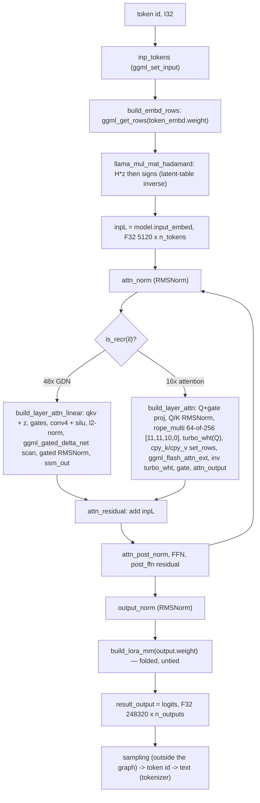

# Forward Pass — one token, id to logits

## Bottom line

A token is an `I32` id in `inp_tokens`; the engine turns it into a row lookup, one residual stream, 64 blocks (16 attention, 48 Gated-DeltaNet), a final norm, and an untied, Hadamard-folded output projection — and the id that comes back out is chosen **outside** the graph by the sampler ([[sampling]], [[tokenizer]]). Two of this fork's three custom stacks live inside that chain: TurboQuant rotates Q and the attention output with in-graph `ggml_turbo_wht` ops and quantizes K/V during the cache write (`set_rows`), while TriAttention prunes the cache *before* the graph is built ([[request-lifecycle]]) and CUDA graphs capture the finished per-token graph ([[cuda-graphs]]).

Three facts the rest of the vault depends on:

1. **The residual stream carries the token with no pooling and no scaling.** `build_inp_embd` emits raw gathered rows (plus the Hadamard inverse; see 2) straight into `inpL` — for `qwen35`, `n_embd_inp == n_embd = 5120`, so no padding, and `f_embedding_scale` (Granite-only) is 0.
2. **`prism.hadamard.inverse_weight_names = ["token_embd.weight"]` means the embedding table *is* folded** — it is the one weight whose fold is undone on the *gather* side rather than the matmul side. The table stores latent (rotated) rows; the graph applies `llama_mul_mat_hadamard` (rotation, then signs) to the looked-up rows before they enter the stream (`src/src/llama-graph.cpp:2398-2414`).
3. **The head is untied.** `output.weight` is a separate `PQ2_0` tensor `[5120, 248320]`, also folded ([[prism-hadamard-weight-fold]]); the tied variant would be `prism.hadamard.version = 2` + `tied_output = true`, which this file is not ([UNVERIFIED] only in the sense that nothing in this repo exercises it — see [[prism-hadamard-weight-fold]]).

## Evidence

### 1. Input ids → embeddings

`build_inp_embd` (`src/src/llama-graph.cpp:2417`) declares both graph inputs: `inp_tokens` (I32, `[n_tokens]`, marked input; `t_inp_tokens`, `:2425-2428`) and `inp_embd` (F32, `[n_embd_inp, n_tokens]`, `:2430-2432`). At build time `ggml_build_forward_select` picks one of the two based on whether the ubatch carries tokens or raw embeddings (`:2475`). The token path (`build_embd_rows`, `:2398`) is:

```
cur = ggml_get_rows(ctx0, tok_embd, ids);          // [5120, n_tokens]
cur = llama_mul_mat_hadamard(ctx0, cur, rot);      // H first …
if (signs) cur = ggml_mul(ctx0, cur, signs);       // … then signs
```

The second and third lines are the inverse of the checkpoint-time fold: `token_embd.weight` is stored in the rotated ("latent") basis, and because a row lookup is a gather, not a matmul, the un-fold happens on the gathered rows (`llama-graph.cpp:2401-2414`; loader contract `src/src/llama-model.cpp:1328-1341` — "tensors consumed by row lookup store latent rows and need the inverse transform applied to the lookup result instead"). Any other name in `inverse_weight_names` is refused at load (`llama-model.cpp:1334-1338`). Note the order differs from the weight path (sign-then-rotation there, rotation-then-sign here); the two are halves of the same symmetric pair `(s, H)` ([[prism-hadamard-weight-fold]]).

No pooling and no normalisation follow: `n_embd_inp == n_embd` for `qwen35` (no pad at `:2462`), the scale at `:2486-2494` is skipped (`f_embedding_scale == 0`), and there is no `n_embd_pooled` key in the file, so `t_embd_pooled` is never built. The result is `t_inp_embd` (`:2483`), named `model.input_embed` in the trunk (`src/src/models/qwen35.cpp`, `cb(inpL, "model.input_embed", -1)`).

### 2. Embedding → the 64-block stack

The trunk is `llama_model_qwen35::graph::graph`, derived from `llm_build_delta_net_base` (`src/src/models/qwen35.cpp:137-138`), and reads hybrid inputs via `build_inp_mem_hybrid()` (`:178`, which builds both `inp_rs` and the attention input — `llm_graph_context::build_inp_mem_hybrid`, `src/src/llama-graph.cpp:3818-3827`). Per layer (`for il in 0..n_layer`, `qwen35.cpp:204`):

1. `attn_norm` — RMSNorm over `inpL` (`build_norm`, `llm_graph_context::build_norm` at `src/src/llama-graph.cpp:1671`).
2. **Routing on `hparams.is_recr(il)`** (`qwen35.cpp:199-202`): recurrent → `build_layer_attn_linear(inp->get_recr(), cur, il)` (the 48 GDN layers); else → `build_layer_attn(inp->get_attn(), cur, inp_pos, sections, il)` (the 16 KV layers at 3, 7, … 63). The interval-4 schedule lives in `qwen35.cpp:20-29`; see [[qwen35-architecture]].
3. Residual: `cur = ggml_add(cur, inpSA)` → `attn_residual` (`qwen35.cpp:212-215`).
4. `attn_post_norm` (RMSNorm), then the dense FFN (`build_layer_ffn`), then `cur = ggml_add(cur, ffn_residual)` → `post_ffn` (`qwen35.cpp:216-231`). `inpL = cur` closes the loop.

Every weight that multiplies the stream is consumed through `build_lora_mm`/`build_lora_mm_id`, which applies the fold's activation-side transform (sign flip → blockwise FWHT; memoised per activation so shared Q/K/V inputs pay once) before the folded matmul (`src/src/llama-graph.cpp:1546-1590`, [[prism-hadamard-weight-fold]]).

### 3. Inside an attention block (the 16 KV-bearing layers)

`build_layer_attn` (`src/src/models/qwen35.cpp:322-402`):

- **QKV projection.** A single fused Q+gate projection: `Qcur_full = build_lora_mm(wq, cur)` gives `[12288, n_tokens]` = 24 heads × 256 (query) + 24 × 256 (gate), interleaved; `Qcur` is a strided view of the first half `[256, 24, n_tokens]`, `gate` a view of the second half (`qwen35.cpp:330-356`). `Kcur`/`Vcur` come from `build_lora_mm(wk/wv, …)` at `[256, 4, n_tokens]` (GQA, 4 KV heads; `qwen35.cpp:340-353`). Per-head RMS norms: `attn_q_norm` → `Qcur_normed`, `attn_k_norm` → `Kcur_normed` (`:335-348`).
- **Partial / MRoPE.** `ggml_rope_multi` on Q and K only, with `n_rot = 64` (from `rope.dimension_count = 64`; `src/src/llama-model.cpp:1484-1490`), sections `[11, 11, 10, 0]` (32 = 64/2 pairs), rope type `IMROPE` (`qwen35.cpp:366-380`; `llama-model.cpp:3243-3247`). The other 192 of 256 head dims are never rotated; V is not rotated at all.
- **KV write.** `build_attn` (the KV-cache FA path, around `src/src/llama-graph.cpp:2955-2998`) emits `mctx_cur->cpy_k(ctx0, k_cur, k_idxs, il)` / `cpy_v(...)` (`:2964-2965`, hook `k_cache_in` at `:2960-2962`). In `llama_kv_cache::cpy_k` (`src/src/llama-kv-cache.cpp:1526`): the optional K mean-centre bias is subtracted (`k_bar`, `:1535-1544`), head dims are zero-padded to 128 (`:1548-1556`), and the write is one `ggml_set_rows(ctx, k, k_cur, k_idxs)` (`:1581`) with the WHT group size (128) stashed in `op_params` for the CUDA kernel (`:1583-1587`; `cpy_v` `:1593-1664`). `k_cur`/`v_cur` stay F32; the cache tensors `layers[ikv].k` / `.v` carry the turbo types and the quantisation happens inside the `set_rows` backend op. The served profile is `-ctk turbo3 -ctv q8_0` ([[turboquant]]; `scripts/start_server_turbo.sh`). Whether the K/V Walsh–Hadamard rotation is folded into that quantiser or applied upstream is a joint open question with [[request-lifecycle]] `[UNVERIFIED]` — the graph itself only ever rotates Q and the output (below).
- **Q rotation.** `q = ggml_turbo_wht(ctx0, q, 0, 128, innerq_scale)` immediately before the attention read, guarded on `k->type ∈ {TURBO2_0, TURBO3_0, TURBO4_0}` (`src/src/llama-graph.cpp:2976-2985`); the InnerQ scale comes from the memory context (`get_turbo_innerq_scale_inv`, [[innerq]]).
- **The read.** `mctx_cur->get_k()/get_v()` (`:2971-2972`) feed `build_attn_mha` (`:2650`), which for `cparams.flash_attn` calls the **fused `ggml_flash_attn_ext`** directly on the quantized cache tensors (`:2690`; `LLM_FUSED_OP_FLASH_ATTN` at `:2692`, `GGML_PREC_F32` at `:2695`) — the kernel dequantises the turbo blocks internally (flash attention is *forced* by the turbo KV types, [[overview]] correction). On the output, the inverse rotation `ggml_turbo_wht(..., inverse=1, 128, innerq_scale)` un-rotates the V contribution (`:2707`; non-FA path `:2785`), and any padded head dims are sliced back off (`:2991-2998`). `kq_scale = 1/√256 = 1/16` (`qwen35.cpp:360-362`).
- **Gate + output.** `attn_pregate` → `sigmoid(gate)` → `attn_gated` → `build_lora_mm(attn_output, …)` (`[6144, 5120]`, folded) → `attn_output` (`qwen35.cpp:386-397`), then the residual and FFN of step 2.

### 4. Inside a recurrent block (the 48 SSM/GDN layers)

The builder is `build_layer_attn_linear` (`src/src/models/qwen35.cpp:403-584`); the math is owned by [[gated-delta-net]] and not restated here. The graph nodes, in order: `qkv_mixed`/`z` from `attn_qkv`/`attn_gate` (`build_qkvz`, `qwen35.cpp:220-239`) → gates `beta` (`beta_sigmoid`), `alpha`, `a_softplus = softplus(α + ssm_dt)`, `gate = a_softplus · ssm_a` (`qwen35.cpp:424-462`) → short causal conv via `build_conv_state` + `ggml_ssm_conv` (`conv_output_raw`) + `ggml_silu` (`conv_output_silu`; channels = `d_inner + 2·n_group·d_state` = 10 240, `qwen35.cpp:467-498`) → Q/K/V view split and joint l2 norm (`qk_conv_l2`, `:503-533`) → the recurrence: `build_recurrent_attn` (`src/src/delta-net-base.cpp:532-593`) dispatches to the fused `ggml_gated_delta_net` (K = 1, autoregressive) or chunked path; live state is read per sequence via `build_rs_cache_view` (`state_cache_view`, rows mode; `llm_graph_context::build_rs` at `src/src/llama-graph.cpp:3641`, `build_rs_cache_view` `:3720`) → gated RMSNorm over `z` (`build_norm_gated`, `ssm_norm`) → reshape `final_output` → `build_lora_mm(ssm_out, …)` (`linear_attn_out`, `qwen35.cpp:551-560`). The per-layer state is F32, `[128, 128, 48]` per sequence, written back into the hybrid recurrent cache ([[hybrid-memory]]).

### 5. After the stack: norm, head, logits

`cur = inpL` → `build_norm(output_norm, …)` → `result_norm` (`qwen35.cpp:274-283`; also `res->t_embd`, the embedding output path) → **the LM head** `cur = build_lora_mm(model.output, cur, model.output_s)` → `result_output` → `res->t_logits` (`qwen35.cpp:287-291`). `set_outputs` marks `t_logits` as a graph output (`src/src/llama-graph.cpp:1385-1388`) and the caller copies it out via `get_logits()` (`src/src/llama-context.cpp:2092-2094`).

**Tied versus untied.** This model is **untied**: `output.weight` exists as a distinct 337 715 200-byte `PQ2_0` tensor `[5120, 248320]` (verified in [[prism-hadamard-weight-fold]]), so the loader's tied fallback — `output = create_tensor(…, TENSOR_NOT_REQUIRED)` then "if output is NULL, init from the input tok embed" (`qwen35.cpp:46-50`) — does not fire; the head is folded and consumed through `build_lora_mm` like every other weight (`src/src/llama-model.cpp:1295-1297`: "the output head is built through build_lora_mm in every arch").

**`--reasoning-budget` / `-n` do not gate the head.** The head node is unconditional in the graph. `-n` only bounds how many tokens the caller requests, and the reasoning-budget knobs are a *sampling-chain* stage (`common_reasoning_budget_init`, `src/common/sampling.cpp:312`; applied first in the chain at `:632`), which forces backend sampling off (`:421-424`) because the reasoning-budget and backend samplers are mutually exclusive — see [[sampling]].

### 6. Where the three custom stacks sit

| Stack | Where in the chain | Consequence |
| :--- | :--- | :--- |
| [[triattention]] | **Before graph build**: `apply_ubatch()` → `triattention_try_prune()` (`src/src/llama-kv-cache.cpp:1373-1374`) evicts cells of the 16 KV layers | Evicted positions are simply absent from the flash-attention read; the graph topology does not change ([[request-lifecycle]]) |
| [[turboquant]] | KV **write** (`set_rows` onto turbo-typed cache tensors, WHT group in `op_params`) and KV **read** (`ggml_flash_attn_ext` dequantising internally); Q pre-rotation and output un-rotation are in-graph `ggml_turbo_wht` ops (`llama-graph.cpp:2985`, `:2707`) | K/V are stored quantized + rotated; only Q and the attention output are ever touched by the custom op; turbo types force the fused attention path |
| [[cuda-graphs]] | Captures the **whole per-token graph** after build, around graph compute | Graph replay amortises the build; the saving is constant, not cumulative ([[cuda-graphs]]) |

### The chain, end-to-end



### Load-bearing tensor shapes (model metadata)

| Tensor | Shape | Type | Notes |
| :--- | :--- | :--- | :--- |
| `token_embd.weight` | `[5120, 248320]` | `PQ2_0` | latent rows; Hadamard-inverted after lookup |
| `embd` / `inpL` | `[5120, n_tokens]` | `F32` | no pooling, no scale |
| `Qcur` | `[256, 24, n_tokens]` | `F32` | 24 heads × 256, partial-RoPE on 64 |
| `Kcur`, `Vcur` | `[256, 4, n_tokens]` | `F32` | 4 KV heads × 256 (GQA, group 6) |
| K cache (per KV layer) | `[1024, kv_size, n_stream]` | `TURBO3_0` (served) | 1024 = 4 × 256; 16 layers only; 2048 elements/token with V |
| V cache (per KV layer) | `[1024, kv_size, n_stream]` | `q8_0` (served) | flash-attention (non-transposed) layout |
| SSM state (per GDN layer/seq) | `[128, 128, 48]` | `F32` | 786 432 elements; fixed, context-independent |
| `result_output` (logits) | `[248320, n_outputs]` | `F32` | head is untied + folded |

Shapes from `[[qwen35-architecture]]` (GGUF-verified) and `[[prism-hadamard-weight-fold]]` (tensor list); `kv_size` is the configured cell count (`-c`).

## Open questions

- **Where exactly is K/V rotated on write?** The graph rotates only Q and the attention output with `ggml_turbo_wht`; `cpy_k`/`cpy_v` emit plain `set_rows` with a WHT group size in `op_params` (`src/src/llama-kv-cache.cpp:1581-1587`). The rotate+quantise step must therefore live in the CUDA `set_rows` kernel — read kernel-side here, not re-derived; joint with [[request-lifecycle]]'s identical open question `[UNVERIFIED]`.
- **Non-rotary dims are rotated and quantized wholesale.** RoPE covers 64 of 256 head dims, yet TurboQuant's 128-element groups and the WHT rotation act on the full head; the 192 non-positional dims are treated like the rest by design (`[[qwen35-architecture]]`, itself `[UNVERIFIED]` on whether that is intended).
- **Tied head is dead code for this artifact.** The loader supports `version 2`/`tied_output` with a latent embedding reused as the head (`src/src/llama-model.cpp:1345-1356`), but no artifact here exercises it; nothing in the repo states whether a tied variant of Bonsai-2-27B exists.

## See also

[[qwen35-architecture]] · [[hybrid-memory]] · [[gated-delta-net]] · [[turboquant]] · [[triattention]] · [[sampling]] · [[request-lifecycle]] · [[prism-hadamard-weight-fold]] · [[tokenizer]] · [[cuda-graphs]] · [[walsh-hadamard-transform]]