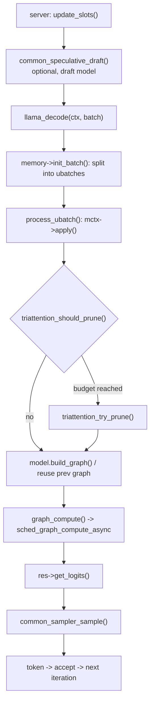

# Request Lifecycle — one request through llama-fast

## Bottom line

There is no request object in this engine. A request is a **sequence of `llama_decode()` calls**, and everything the three fork-specific optimizations do happens **inside** one of those calls or immediately around it. The path is:

1. **Server accept loop.** `server_context::update_slots()` (`src/tools/server/server-context.cpp:2707`) picks a slot, assembles the batch and calls `llama_decode(ctx_tgt, batch_view)` (`src/tools/server/server-context.cpp:3596`). All decodes are funneled through `queue_tasks.yield_to_queue(...)`.
2. **Drafting (speculative only).** Before the target decode, `common_speculative_draft(spec.get())` (`src/tools/server/server-context.cpp:2960`) produces draft tokens from the draft model; `common_speculative_process()` (`:3661`) feeds them into the target batch. Without a draft model this step vanishes and the loop degenerates to one token per decode.
3. **Entry point.** `llama_decode()` (`src/src/llama-context.cpp:4539`) forwards to `llama_context::decode()` (`:1873`). Batch metadata is normalized by the batch allocator (`balloc->init(...)`), then `sched_reserve()` (`:700`) makes sure the backend scheduler has room for the graph.
4. **Memory context + ubatch split.** `memory->init_batch(*balloc, cparams.n_ubatch, output_all)` decides which cells the batch needs; the `do { ... } while (mctx->next())` loop in `decode()` walks the resulting **ubatches**, each at most `cparams.n_ubatch` tokens. `LLAMA_MEMORY_STATUS_FAILED_PREPARE` triggers exactly one retry with `memory_update(true)` — this is defragmentation, not pruning.
5. **Cache bookkeeping and eviction.** `process_ubatch()` (`src/src/llama-context.cpp:1548`) first calls `mctx->apply()` (`:1549`), which lands in `llama_kv_cache::apply_ubatch()` (`src/src/llama-kv-cache.cpp:1271`). This is where `prefix_length` is latched (`:1354-1362`) and where **TriAttention pruning is invoked** (`:1373-1374`), *before* any graph is built.
6. **Graph build.** Still inside `process_ubatch()`: the previous graph is reused if its topology is unchanged, otherwise `model.build_graph(gparams)` (`src/src/llama-context.cpp:1581`). Every layer emits KV reads (`mctx_cur->get_k()` / `get_v()`), KV writes (`mctx_cur->cpy_k()` / `cpy_v()`, e.g. `src/src/llama-graph.cpp:2964-2965`) and the **TurboQuant WHT ops** (`:2985` forward on Q, `:2707` inverse on the attention output).
7. **Execution.** `graph_compute(res->get_gf(), ubatch.n_tokens > 1)` (`src/src/llama-context.cpp:1608`, definition `:2763`) calls `ggml_backend_sched_graph_compute_async()` (`:2782`). The compute is asynchronous; `cparams.pipeline_parallel` forces a sync before the next `set_inputs`.
8. **Logits out.** `res->get_logits()` / `get_embd()` / `get_h_nextn()` (`src/src/llama-context.cpp:2092-2094`) copy the graph outputs into the context's padded output buffers (`output_reserve`). Perf accounting closes the call at `:837-840`.
9. **Sampling.** Sampling is **not** in the graph and **not** in `llama_context::decode()`. The caller does it: `common_sampler_sample(slot.smpl.get(), slot.ctx_tgt, tok_idx)` (`src/common/sampling.cpp:594`, called at `src/tools/server/server-context.cpp:3770`). This is the only place a token id is chosen.
10. **Accept and loop.** The chosen token is appended, `common_sampler_accept()` updates the sampler chain state, and the next `decode()` re-enters at step 3. In the speculative path step 9 is replaced by `common_sampler_sample_and_accept_n()` (`src/tools/server/server-context.cpp:3828`) followed by `common_speculative_accept()` (`:3873`).

`llama_context::encode()` (`src/src/llama-context.cpp:1620`) is the sibling path: it calls `process_ubatch(..., LLM_GRAPH_TYPE_ENCODER, nullptr, ...)` (`:1686`) with **no** memory context at all — no KV cells, no pruning, no cache. `decode()` falls back to it when `!memory` (`:1879`).

## Evidence

### Where the graph is built and executed, and the hybrid difference

The build/execute split is a four-line contract in `process_ubatch()`: `mctx->apply()` → `model.build_graph(gparams)` → `graph_compute()` → `res->get_*()` (`src/src/llama-context.cpp:1549`, `:1581`, `:1608`). The graph is rebuilt only when the topology changes; otherwise the previously built `llm_graph_result` is reused.

A hybrid model changes **which tensors exist per layer**, not the loop:

- `llama_hparams::has_kv(uint32_t il)` gates KV-layer existence via `n_layer_kv_from_start` (`src/src/llama-hparams.cpp:274-278`). Layers for which it is false are skipped when the cache is allocated — `LLAMA_LOG_DEBUG("layer %3d: does not have KV cache")` (`src/src/llama-kv-cache.cpp:188-191`) — so there is simply no `k`/`v` tensor to look up in `map_layer_ids` for them.
- Non-KV layers instead carry a **recurrent state**, dispatched through the hybrid memory module: `llm_graph_context::build_inp_mem_hybrid()` builds *both* an `inp_rs` (recurrent state) and an attention input from the same memory context (`src/src/llama-graph.cpp:3818-3827`, with `get_recr()` / `get_attn()`), and the SSM layers are built by `llm_graph_context::build_rs()` (`:3641`). The relevant headers are `llama-memory-hybrid-iswa.h` / `llama-memory-recurrent.h` (`src/src/llama-graph.cpp:16-17`).
- Layers can also **reuse another layer's cells**: `hparams.n_layer_kv_from_start` drives a `reuse` callback so that every layer at or beyond that index points at an earlier layer's cache (`src/src/llama-model.cpp:2842-2849`), and `map_layer_ids[il] = map_layer_ids[il_reuse]` records it (`src/src/llama-kv-cache.cpp:399-401`).

The concrete "16 of 64 layers have KV" figure comes from [[qwen35-architecture]] prose; the mechanism above is what the code enforces. The exact layer counts in this checkout's model config were not re-verified here `[UNVERIFIED]`.

Consequence for the rest of the vault: eviction, rotation and KV-quantization only apply to the attention layers at all. The SSM layers' state is *not* a KV cache and is not touched by TriAttention or TurboQuant — see [[hybrid-memory]], [[gated-delta-net]], [[kv-cache]].

### Where TriAttention's pruning is invoked from, and what triggers it

Call site, exactly one: `llama_kv_cache::apply_ubatch()` calls `triattention_try_prune()` when `triattention_should_prune(triattention_st, n_used)` is true (`src/src/llama-kv-cache.cpp:1373-1374`), i.e. from `mctx->apply()` at graph-build time (`src/src/llama-context.cpp:1549`) — **not** from the graph, and **not** from a timer thread. The public entry is `llama_kv_cache::triattention_try_prune()` (`src/src/llama-kv-cache.cpp:3015`, declared `src/src/llama-kv-cache.h:261`).

Trigger (`triattention_should_prune`, `src/src/llama-triattention.cpp:809-819`):

- `TRIATTENTION_TRIGGER_INTERVAL`: `n_used >= budget && absolute_position > 0 && absolute_position % divide_length == 0`.
- `TRIATTENTION_TRIGGER_SLACK`: `n_used >= budget + divide_length`.

So pruning fires **only on token-count boundaries that are multiples of `divide_length`**, and only once the cache is full. `divide_length` therefore plays two roles: the prune interval *and* the recent-token protection window (`recent_threshold = max_pos - divide_length + 1`, `src/src/llama-triattention.cpp:1128`; protected cells are excluded from scoring at `:1136-1141`). The recent-window protection exists so `seq_pos_max` is unchanged after eviction, keeping the server's `Y = X + 1` batch validation valid (`src/src/llama-kv-cache.cpp:3060-3064`).

Prune internals (`triattention_prune_impl`, `src/src/llama-triattention.cpp:1064-1065` "called from `llama_kv_cache::triattention_try_prune()`"):

1. enumerate occupied cells, bail if `n_occupied <= budget` (`:1108-1109`);
2. split off prefix-protected cells (`protect_prefill && pos < state->prefix_length`, `:1136-1137`) and recent cells;
3. `decode_budget = budget > n_protected ? budget - n_protected : 0`, bail if `n_decode <= decode_budget` (`:1150-1152`);
4. score sampled heads, then `top_k_indices(state->keep_indices, combined, n_decode, decode_budget)` — one call per mode: global union `:1345`, per-KV-head `:1399`, per-layer-per-head `:1421`;
5. evict everything not in the keep set.

`state->prefix_length` is latched on the **first multi-token batch containing position 0** (`ubatch.n_tokens > 1 && has_pos_zero` → `prefix_length = max_batch_pos + 1`, `src/src/llama-kv-cache.cpp:1352-1363`) and reset to 0 on cache clear (`src/src/llama-triattention.cpp:671`, `:793`). When prefix + recent already exhaust the budget, `decode_budget` collapses to 0 and every prune is a no-op — that is the mechanism behind [[ta-2-budget-starvation]]. The KV readback for scoring is dequantized per head on the CPU and is documented as acceptable precisely because pruning is infrequent (`src/src/llama-triattention.cpp:538-539`) — the transfer cost profile of [[ta-3-cpu-fallback-transfers]].

### Where the TurboQuant rotation lands in the graph

Rotation is a **custom op in the compute graph**, `ggml_turbo_wht`, inserted at graph build; it is not a preprocessing pass.

- Q, forward rotation (`inverse = 0`, group 128): `q = ggml_turbo_wht(ctx0, q, 0, 128, innerq_scale)` immediately before `build_attn_mha()` in the KV-cache attention path (`src/src/llama-graph.cpp:2985`), the K-only/MLA path (`:3108`) and the ISWA path (`:3299`). Guards: `k->type` is `TURBO2_0 | TURBO3_0 | TURBO4_0`, with Q padded to a 128 multiple first (`:2976-2984`).
- Attention output, inverse rotation (`inverse = 1`): `cur = ggml_turbo_wht(ctx0, cur, 1, turbo_group, innerq_scale)` inside `llm_graph_context::build_attn_mha()` (`src/src/llama-graph.cpp:2707`, non-FA path `:2785`), which is the V un-rotation. `turbo_group` is 128 when the head dim is 128-aligned, else 64 (`:2703`, `:2781`).
- Both ops take `mctx->get_turbo_innerq_scale_inv()` (`src/src/llama-graph.cpp:2706`, `:2784`, `:2984`) — the per-channel InnerQ equalization rides inside the same op as the rotation, so [[innerq]] calibration state reaches the graph through the memory context, not through the graph params.
- KV **writes** are separate ops expanded into the same graph: `cpy_k(ctx0, k_cur, k_idxs, il)` / `cpy_v(...)` (`src/src/llama-graph.cpp:2964-2965`, `:3276-3283`). The comment there names `k_cur` the *"exactly the K tensor that `cpy_k()` writes into the cache, after any RoPE/rotation the architecture applies upstream"* (`:2959-2962`), and the `"k_cache_in"` callback hangs off it. Whether K/V rotation is applied by the architecture before `cpy_k` or by the turbo type's quantizer during the write was **not** traced here `[UNVERIFIED]`.
- The rotation matrices themselves live on the cache (`get_turbo_rotation()` / `get_turbo_rotation_inv()`, `src/src/llama-kv-cache.h:184-188`) and are allocated as extra tensor overhead (`src/src/llama-kv-cache.cpp:139-140`).

Cost shape: correctness of this op is [[walsh-hadamard-transform]] and [[ta-1-wht-inversion-256]]; the arithmetic that consumes the rotated, quantized K/V is where the time actually goes — see [[turboquant]], [[gemm-dispatch]].

### How speculative decoding changes the loop

- The **server**, not the engine, drives it: `common_speculative_draft()` (`src/tools/server/server-context.cpp:2960`) fills `slot.spec_draft` from the draft model, with `n_draft_max` set per draft request (`:2942-2945`).
- The target still sees one ordinary `llama_decode()` — but of up to `n_draft + 1` tokens. `common_speculative_process()` (`:3661`) merges the draft tokens into the batch before it is submitted to `llama_decode` (`:3596`).
- Verification is **batched sampling**: `common_sampler_sample_and_accept_n(smpl, ctx, slot.spec_i_batch, slot.spec_draft)` (`src/tools/server/server-context.cpp:3828`), which asserts `idxs.size() == draft.size() + 1` and returns the accepted prefix (`src/common/sampling.cpp:678-679`); acceptance is then reported back with `common_speculative_accept()` (`:3873`).
- Consequence for the cache: the same `apply_ubatch()` path runs, so a multi-token speculative batch can cross a `divide_length` boundary and fire TriAttention pruning inside a verify step. A rejected draft is rolled back with `memory->seq_rm()`, which is the same rollback used when a ubatch fails (`src/src/llama-context.cpp:2056-2078`).
- The MTP flavor of speculative decoding is visible in the engine itself: `decode()`/`encode()` accept batches carrying **both** `token` and `embd` (`src/src/llama-context.cpp:1621-1623`, `:1874-1876`), and `cparams.ctx_type == LLAMA_CONTEXT_TYPE_MTP` selects the graph type via `ctx_type_to_graph_type()` (`:2054`), with `set_dspark_ctx()` staging drafter features (`:1377`).

Details of the drafter and its budget: [[speculative-decoding]], [[qwen3-dflash-draft]].

### Where sampling happens and what reaches it

Sampling is entirely in `common/`, outside the engine core. `common_sampler_init(model, params)` (`src/common/sampling.cpp:187`) builds the chain from `common_params_sampling`; `common_sampler_sample()` (`:594`) does:

1. `llama_synchronize(ctx)` (`:595`) — the async graph from step 7 must be complete before the logits can be read;
2. `gsmpl->set_logits(ctx, idx)` (`:609`) pulls the row for output index `idx`;
3. check `llama_get_sampled_token_ith(ctx, idx)` (`:613`) — if a **backend sampler** already chose a token on the GPU, the CPU chain is skipped entirely (grammar and reasoning-budget samplers are asserted off in that mode);
4. otherwise apply, in order: reasoning budget, then grammar (if `grammar_first`), then the main chain via `llama_sampler_apply(chain, &cur_p)`;
5. `id = cur_p.data[cur_p.selected].id` (`:643`), with grammar-rejection resampling if the grammar rejects the choice.

Parameters therefore reach sampling as `common_params_sampling` (temperature, top-k/top-p/min-p, repeat/frequency/presence penalties, grammar, reasoning budget, and the backend-sampling switches) — they never enter `llama_context`. `cparams.n_outputs_max_per_seq` is the engine-side limit that bounds how many outputs one sequence may sample from a batch (`src/src/llama-context.cpp:1900-1906`). Full parameter surface: [[sampling]].

Statistics/time attribution (`n_prompt_tokens_processed`, `slot.print_timings()`, `send_final_response()`) live in the server at `src/tools/server/server-context.cpp:657`, `:3084-3085`, `:3801-3802`; the engine-side counter is `t_eval_us` in `llama_context` (`src/src/llama-context.cpp:837-840`). Cost analysis: [[performance-profile]].

## Open questions

- Where exactly does K/V get rotated — inside the architecture before `cpy_k()`, or inside the turbo-type quantizer during the write? The graph only shows the Q rotation and the output un-rotation. `[UNVERIFIED]`
- `triattention_try_prune()` is called from `apply_ubatch()`, i.e. *before* the current ubatch's keys are scored for the graph. Pruning therefore always scores the cache as of the **previous** token. Is that deliberate, or does it make the newest token's KV row unstable at prune boundaries?
- A prune that fires mid-`n_ubatch` loop changes the cache between ubatches of one logical `decode()`. No test or guard for that interleaving was found here.
- The server's `LLAMA_MEMORY_STATUS_FAILED_PREPARE` retry (`memory_update(true)`) and TriAttention eviction are two independent mechanisms for freeing cells. Neither knows about the other's budget.
- Is `divide_length` the right knob to overload as both prune interval and recency window? Shortening the interval also shortens the protected tail.
- Which HTTP request shape exercises the `encode()` path (no memory, no KV, no TriAttention) in this fork — is that path dead weight or used by the embedding server mode? `[UNVERIFIED]`

## See also

[[overview]] · [[codebase-map]] · [[triattention]] · [[turboquant]] · [[hybrid-memory]] · [[kv-cache]] · [[kv-eviction]] · [[sampling]] · [[speculative-decoding]] · [[walsh-hadamard-transform]] · [[qwen35-architecture]] · [[ta-2-budget-starvation]] · [[forward-pass]]
